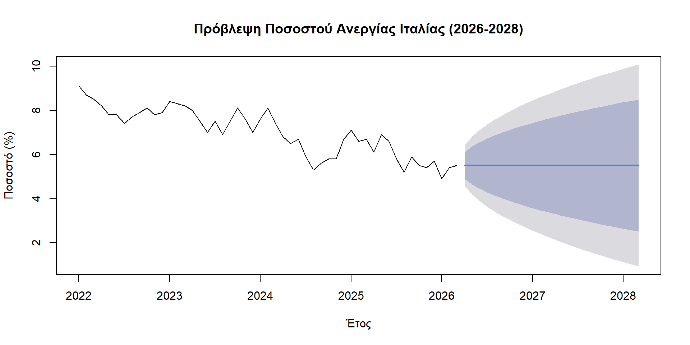
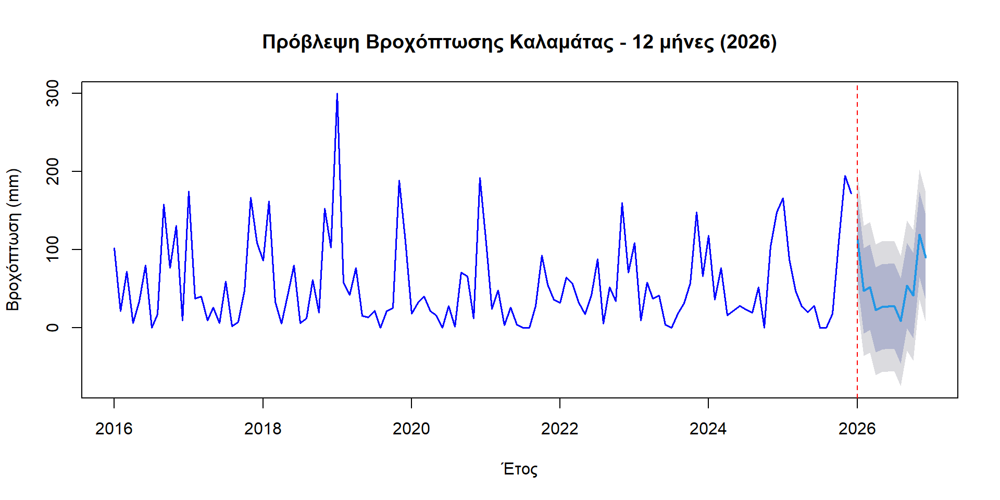
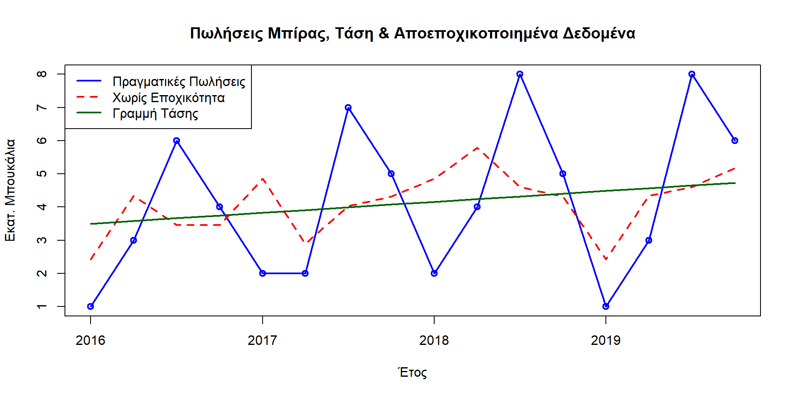

# Time Series Analysis & Forecasting in R

Statistical analysis and forecasting across three time series with different structural properties - macroeconomic (trend-dominated), climatic (seasonality-dominated), and business (trend + seasonality combined) - using the Box-Jenkins methodology (ARIMA/SARIMA) and classical multiplicative decomposition.

**Stack:** R · RStudio · `forecast` · `tseries` · `uroot` · `readxl`

## Why this matters

Time series data carries temporal dependency that standard statistics can't capture - today's value depends on yesterday's. Correctly diagnosing *why* a series is non-stationary (trend? seasonality? both?) determines which model family will work and which won't. This project deliberately picks three series with different underlying structure to demonstrate that diagnosis process end-to-end: an ADF/KPSS/Canova-Hansen toolkit, ACF/PACF-driven model selection, and residual diagnostics - rather than defaulting to one model type for every problem.

## What this project covers

### 1. Italian Unemployment Rate (ARIMA) - trend-dominated series
Monthly unemployment data (Eurostat, Jan 2022 – Mar 2026). The series shows a clear downward trend (9.1% → 5.5%) with no meaningful seasonality. First-differencing (d=1) achieves stationarity (ADF p=0.046); ACF/PACF of the differenced series show no significant lags, pointing to **ARIMA(0,1,0)** - a random walk, confirmed as the best fit by AIC (69.62) against 5 alternative specifications, and validated via Ljung-Box on residuals (p=0.247).

### 2. Kalamata Rainfall (SARIMA) - seasonality-dominated series
Monthly rainfall (mm) from the Hellenic National Meteorological Service, Jan 2016 – Dec 2025 (120 observations, 5 missing values imputed via seasonal mean). KPSS confirms no trend (d=0); strong seasonal non-stationarity (period s=12) is resolved via seasonal differencing (D=1). ACF/PACF of the seasonally-differenced series point to **SARIMA(0,0,0)(1,1,1)[12]**, which outperforms `auto.arima`'s suggestion on both residual variance (1649 vs 2306) and Ljung-Box (p=0.867 vs p=0.053).

### 3. Beer Sales (Classical Decomposition) - trend + seasonality combined
Quarterly beer sales (2016–2019, millions of bottles). Multiplicative decomposition (Y = T × S × C × I) via centered moving averages isolates seasonal indices (Summer +74%, Winter −59%), a weak but positive trend (b=0.082M bottles/quarter, R²=0.167, not statistically significant at p=0.116), and cyclical residuals reaching +36.4% (Spring 2018) and −46.0% (Winter 2019) - attributable to exogenous economic factors rather than seasonality or trend.

### ARIMA(0,1,0) forecast - Italian unemployment (2026–2028)


### SARIMA(0,0,0)(1,1,1)[12] forecast - Kalamata rainfall (2026)


### Classical decomposition - deseasonalized beer sales


## Key findings

### Italy unemployment - why forecast it at all?
Unemployment forecasts feed directly into social policy planning - knowing whether a trend is likely to continue tells governments and analysts how much runway they have before needing to act. Here, the unemployment rate fell steadily from 9.1% to 5.5% between 2022 and 2026, with no seasonal pattern strong enough to matter. That simplicity is itself informative: because differencing the series once removed all statistical structure, the best model turned out to be a random walk (**ARIMA(0,1,0)**) - in plain terms, the model's honest best guess for next month is simply this month's value, and it can't detect any repeating cycle to exploit. Confirmed as the best fit among 6 candidate models (AIC=69.62) and validated on residuals (Ljung-Box p=0.247, meaning no leftover structure was missed).

### Kalamata rainfall - separating seasonal noise from real change
For climate data, the key practical question is: is the pattern changing, or just repeating? Here it's clearly the latter - rainfall swings from wet winters to dry summers every single year (s=12 months), a signature of the Mediterranean climate, with no evidence of a long-term shift. Modeling this required a **SARIMA(0,0,0)(1,1,1)[12]** model, which explicitly encodes that yearly repeat pattern rather than treating each month as independent. It outperformed R's automatic model-selection tool (`auto.arima`) on both error variance and residual whiteness (Ljung-Box p=0.867 vs. 0.053) - worth noting because the automatic tool actually got this one wrong, which is a useful caution about not blindly trusting automated model selection.

### Beer sales - telling growth apart from seasonal noise
For a business, the question isn't just "are sales going up" - it's "are sales going up *after* accounting for the fact that summer is always busier." Raw sales numbers here are dominated by that seasonal swing (summer sales run 74% above average, winter 59% below), which would make a naive year-over-year comparison misleading. After mathematically removing that seasonal effect (classical multiplicative decomposition), a modest underlying growth trend remains (+0.082M bottles/quarter) - but it's not yet statistically distinguishable from noise (p=0.116), meaning there isn't enough evidence yet to say the business is reliably growing rather than just fluctuating. The cyclical swings that are left over (up to +36% or -46% in a given quarter) point to outside economic factors - competitor pricing, income shifts - that neither trend nor season explain.

### Summary table

| Series | Finding | Model | Validation |
|---|---|---|---|
| Italy unemployment | Steady decline, 9.1% → 5.5% (2022–2026); no seasonality detected | ARIMA(0,1,0) | AIC=69.62 (best of 6); Ljung-Box p=0.247 |
| Kalamata rainfall | Strong Mediterranean seasonal cycle (wet winters, dry summers); no long-term trend | SARIMA(0,0,0)(1,1,1)[12] | Ljung-Box p=0.867 (vs p=0.053 for auto.arima) |
| Beer sales | Summer sales 74% above average, winter 59% below; weak, not-yet-significant growth trend (p=0.116) | Multiplicative decomposition | R²=0.167 for trend fit |

Full methodology, all 20 figures, statistical test outputs, and detailed discussion are in the knitted HTML reports under [`notebooks_html/`](notebooks_html/).


> - [Exercise 1 - Italy Unemployment (ARIMA)](https://htmlpreview.github.io/?https://github.com/alagogianni/timeseries-r-analysis/blob/main/notebooks_html/01_Askisi1_Anergia_Italias.html)
> - [Exercise 2 - Kalamata Rainfall (SARIMA)](https://htmlpreview.github.io/?https://github.com/alagogianni/timeseries-r-analysis/blob/main/notebooks_html/02_Askisi2_Vrochoptosi_Kalamatas.html)
> - [Exercise 3 - Beer Sales (Decomposition)](https://htmlpreview.github.io/?https://github.com/alagogianni/timeseries-r-analysis/blob/main/notebooks_html/03_Askisi3_Poliseis_Mpiras.html)
>
> Alternatively, clone the repo and open the files locally in any browser.

## Repository structure

```
timeseries-r-analysis/
├── README.md
├── LICENSE                       # MIT
├── .gitignore
├── exercises/
│   ├── 01_Askisi1_Anergia_Italias.Rmd        # ARIMA - Italian unemployment
│   ├── 02_Askisi2_Vrochoptosi_Kalamatas.Rmd  # SARIMA - Kalamata rainfall
│   └── 03_Askisi3_Poliseis_Mpiras.Rmd        # Classical decomposition - beer sales
├── notebooks_html/                # Knitted HTML reports - open directly in a browser, no R needed
│   ├── 01_Askisi1_Anergia_Italias.html
│   ├── 02_Askisi2_Vrochoptosi_Kalamatas.html
│   └── 03_Askisi3_Poliseis_Mpiras.html
└── results/figures/                # charts exported from the knitted HTML outputs
```

## Data

- **Exercise 1 (unemployment):** requires `italy_unemployment.xlsx` - download from [Eurostat](https://ec.europa.eu/eurostat) (unemployment by sex and age, monthly, unadjusted; filter for Italy)
- **Exercise 2 (rainfall):** requires `emi.csv` - monthly rainfall data for Kalamata, from the [Hellenic National Meteorological Service (ΕΜΥ)](http://oldportal.emy.gr/emy/el/climatology/climatology_city)
- **Exercise 3 (beer sales):** fully self-contained - the data is hardcoded directly in the `.Rmd` (16 quarterly observations), no external file needed

Neither raw dataset is included in this repository (see `.gitignore`); place them alongside the corresponding `.Rmd` file before knitting.

## Running it

Requires R and RStudio, with the following packages:

```r
install.packages(c("readxl", "forecast", "tseries", "uroot"))
```

Each `.Rmd` in `exercises/` is self-contained - open in RStudio and knit to HTML, or run:

```r
rmarkdown::render("exercises/01_Askisi1_Anergia_Italias.Rmd")
```

Exercises 1 and 2 require their respective data files (see **Data** above) to be present in the same folder before knitting.

## Author

MSc coursework project - Information Systems & Services, University of Piraeus, 2026.

## References

- Box, G. E. P., Jenkins, G. M., Reinsel, G. C., & Ljung, G. M. (2015). *Time series analysis: Forecasting and control* (5th ed.). Wiley.
- Eurostat. (2026). Unemployment by sex and age – monthly data – unadjusted [Dataset]. European Commission.
- Ελληνική Μετεωρολογική Υπηρεσία (Ε.Μ.Υ.). (2025). Κλιματικά δελτία – Καλαμάτα [Dataset].
- R Core Team. (2024). *R: A language and environment for statistical computing* (Version 4.4) [Software]. R Foundation for Statistical Computing.

## License

Code (R Markdown scripts) is licensed under [MIT](LICENSE). This does not extend to the third-party data (Eurostat, ΕΜΥ) used by the analysis, which remains subject to its respective source's terms - see **Data** above.
